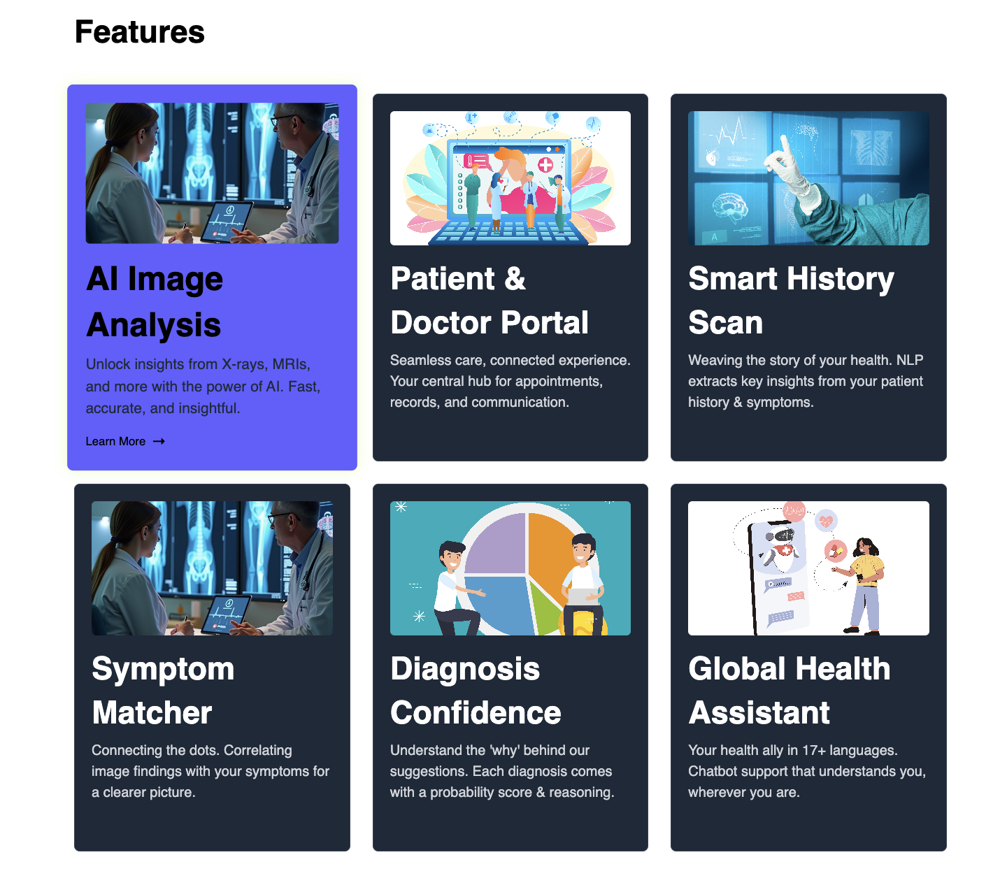
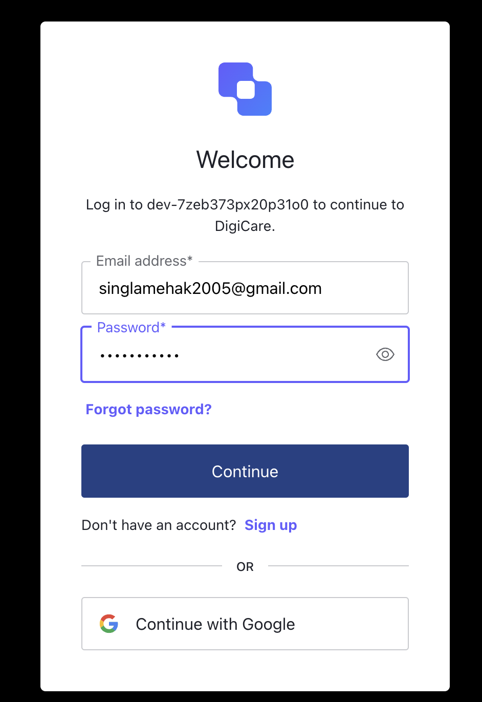
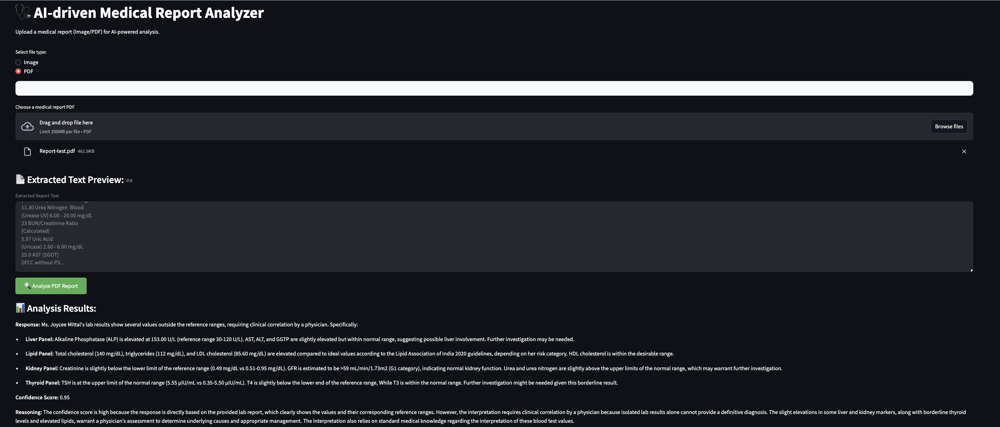
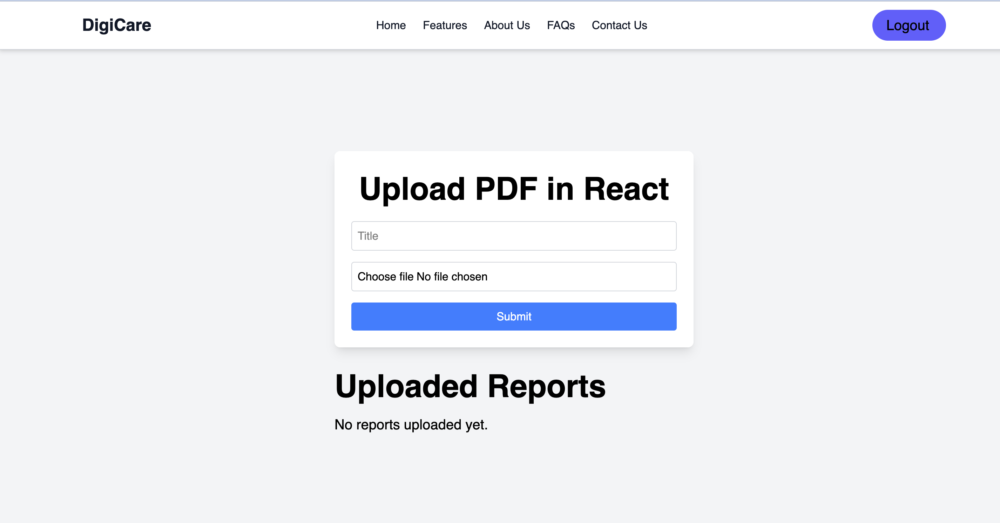
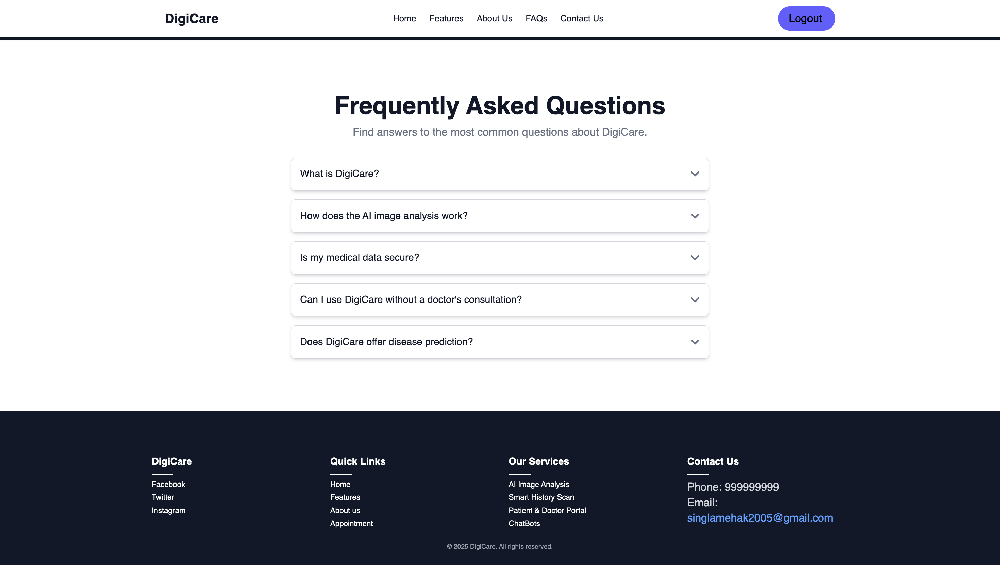

# 🚀 DigiCare - AI-Powered Diagnostic Assistant  

🔬 **From Symptoms to Solutions – DigiCare Got You Covered!**  
An AI-powered diagnostic assistant designed to help healthcare professionals make faster, more accurate diagnoses.  
Analyze medical images, patient data, and symptoms with unparalleled efficiency.  

---

## 🌟 Features  

✅ **AI Image Analysis** – Unlock insights from X-rays, MRIs, and more with the power of AI. Fast, accurate, and insightful.  
✅ **Smart History Scan** – AI extracts key insights from patient history & symptoms.  
✅ **Patient & Doctor Portal** – A central hub for appointments, records, and seamless communication.  
✅ **Symptom Matcher** – Correlating image findings with symptoms for a clearer diagnosis.  
✅ **Diagnosis Confidence** – Each diagnosis comes with a probability score & reasoning.  
✅ **Centralized Medical Data Storage & Analysis** – A secure and unified platform for lifetime patient records.  
✅ **Emergency Support & Quick Decision-Making** – Rapid access to patient histories to aid in critical situations.  
✅ **Intelligent Report Interpretation** – Instantly analyzes lab reports, CT scans, and X-rays for clear insights.  

---

## 📸 Screenshots  

| Feature | Screenshot |
|---------|------------|
| 🏠 Home Page |  |
| 🔍 Features |  |
| 🔐 Sign In |  |
| 📑 AI Report Analyser |  |
| 📤 Upload Portal |  |
| ❓ FAQs |  |

---

## 🛠 Tech Stack  

**Frontend:** React.js, Streamlit, Tailwind CSS 
**Backend:** Node.js, MongoDB, Auth0  
**Storage:** Cloudinary  
**AI Feature:** Gemini API, Langchain  

---

## 🏥 About Us  

### Revolutionizing Healthcare, One Patient at a Time 🏥  
At **DigiCare**, we're not just imagining the future of healthcare — we're building it.  
Fueled by innovation and a deep commitment to **patient-first solutions**, we’re transforming the way care is delivered.  

🚀 Our intelligent platform bridges the gap between **technology and compassion**, offering seamless, personalized healthcare experiences.  
With **DigiCare**, it’s not just about treatment — it’s about empowering **healthier lives**.  

---

### 💡 How to Run Locally  

1️⃣ Clone the repository:  
```sh
git clone https://github.com/mehaksingla2005/DigiCare-GH
```
2️⃣ Install dependencies:  
```sh
cd DigiCare
npm install
```
3️⃣ Start the development server:  
```sh
npm start
```
4️⃣ Access the app at:  
```
http://localhost:3000
```

---

## 📬 Contact  

📧 **Email:** singlamehak2005@gmail.com 
🌐 **Website:** [DigiCare]([https://yourwebsite.com](https://www.linkedin.com/in/mehak-singla-b6a655258/))  
🤝 **Contributors:** @mehaksingla2005


